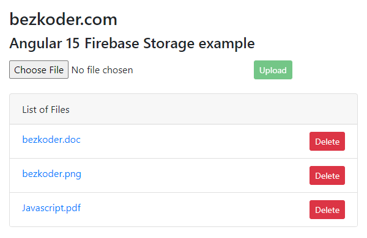

# Angular 15 File Upload to Firebase Storage example

Angular 15 Firebase Storage: File Upload/Display/Delete Application using `@angular/fire` & `AngularFireStorage`. Files' info will be stored in Firebase FireStore.

For more detail, please visit:
> [Angular 15 Firebase Storage: File Upload/Display/Delete example](https://www.bezkoder.com/angular-15-firebase-storage/)
